# AKD — Accelerated Knowledge Discovery

**AKD** is a NASA-IMPACT program building AI-augmented tools that help scientists find, evaluate, and reason about scientific knowledge — datasets, code, literature, methods — across NASA's Science Mission Directorate. Purpose-built agents handle individual steps of a scientific workflow; humans stay in the loop for approval and interpretation.

This repository (`akd-suite`) is the meta-repository for AKD: it documents every public AKD repo and product, and is the entry point for understanding how the pieces fit together. Code lives in the working repos linked below.

Two repositories lay the foundations for this ecosystem:

- [NASA-IMPACT/AI-Agents-for-Science](https://github.com/NASA-IMPACT/AI-Agents-for-Science) — the vision and guiding principles that define AKD.
- [NASA-IMPACT/akd-care](https://github.com/NASA-IMPACT/akd-care) — the **CARE (Collaborative Agent Reasoning Engineering)** methodology used to design AKD's domain agents: a collaborative, artifact-driven discipline for building scientific agents.

---

## Team pathways through AKD

Pathways through AKD are framed at the **team level** — the path a team working on scientific AI takes through AKD based on the end goal it is targeting. The per-agent lifecycle (below) is the lower-level mechanic that some — not all — team pathways exercise. Different teams pursue different goals and travel different pathways.

| # | Team pathway | End goal | Primary delivery surface | Status |
|---|---|---|---|---|
| **A** | **Domain Agent Team** | Ship a single-purpose scientific agent on Flow (data discovery, code discovery, research synthesis, etc.) | AKD Flow | Operational (CMR, PDS, Astro, Code Search, Gap) |
| **B** | **Closed-Loop Workflow / AI Research Labs Team** | Ship a multi-stage scientific workflow with HITL gates between stages | AKD Flow (workflow canvas) | Operational (CM1) |
| **C** | **Open-Source Agent Toolkit Team** | Publish a reusable agent or tool for the community | GitHub release | Operational |
| **D** | **Domain Guardrail Team** | Ship a CARE-derived domain Risk Agent (output guardrail) | Bundled with corresponding domain agents | Emerging |
| **E** | **Tool / MCP Team** | Ship a new scientific MCP server | MCP endpoint + Tools Registry | Operational (CMR, PDS, ADS, Astroquery, Code Search, Job Mgmt) |
| **F** | **Adopter / Self-Host Team** | Run AKD on the team's own infrastructure | Personal cloud or on-prem | Roadmap |
| **G** | **RAG Chatbot Team** | Ship a science-grounded RAG chatbot | Application Components | Roadmap |
| **H** | **Researcher / Scientist (consumer)** | Use AKD to do science (the consumer pathway) | Any delivery surface | Operational |

Pathways are not exclusive — a team may run more than one in parallel, and the same agent may travel through several. Governance gates apply differently per pathway; see [`pathways-governance.md` §2.6](./pathways-governance.md) for the per-pathway governance map.

The **A2A / Agent Marketplace** is a core AKD service rather than a team pathway: AKD itself operates the marketplace and registry, and its governance gates (registry approval, cross-org auth, public-use policy per surface) live in the [governance framework](#governance). Teams targeting A2A as a delivery surface do so through Pathways A or B.

The diagram below describes the **agent lifecycle** that the most common pathway today (Pathway A) exercises, alongside the target shape. Other pathways take different subsets — see [`pathways-governance.md` §1.2 and §1.3](./pathways-governance.md).

## Agent lifecycle — today and target

A single view of the agent lifecycle. **Solid orange** nodes are operational today (Pathway A's code-path mechanic: four hand-synced artifacts, deploy, Flow as the only runtime surface, per-agent runtime governance). **Dashed cyan** nodes are the target — the data-path future where one composition artifact replaces the four, flows through stack-aligned governance gates, lands in multi-registry storage, and is consumed by any delivery surface (with platform services backing them under SLAs). Of the four target registries (Agents, Tools, Notebooks, Documents/Code), only the Agent Registry exists today. Operational details are in [`pathways-governance.md`](./pathways-governance.md); the gap is in [`roadmap.md`](./roadmap.md).

```mermaid
flowchart TD
    classDef shared     fill:#e8f0fe,stroke:#4a90e2,stroke-width:2px,color:#000
    classDef today      fill:#fff3e0,stroke:#ef6c00,stroke-width:2px,color:#000
    classDef todayGate  fill:#fde7f3,stroke:#ad1457,stroke-width:2px,color:#000
    classDef todayRT    fill:#fff8e1,stroke:#f9a825,stroke-width:1.5px,color:#000
    classDef target     fill:#e0f7fa,stroke:#00838f,stroke-width:2px,stroke-dasharray:6 4,color:#000
    classDef targetGate fill:#fde7f3,stroke:#ad1457,stroke-width:2px,stroke-dasharray:6 4,color:#000

    Design["CARE Design<br/>akd-care"]:::shared
    Author["Author + Validate<br/>akd-labs"]:::shared
    Design --> Author

    %% ===== TODAY (operational) =====
    SMEgate{{"SME approval<br/>at akd-ext PR"}}:::todayGate

    subgraph TodayCode ["Today · code path · 4 hand-synced artifacts"]
        direction TB
        Ext["1 · akd-ext PR<br/>OpenAIBaseAgent + schemas + guardrails"]:::today
        Pin["2 · tag akd-ext +<br/>bump pin in akd-services"]:::today
        Reg["3 · register_agent in<br/>akd-services/main.py"]:::today
        UI["4 · AVAILABLE_AGENTS<br/>in akd-flow"]:::today
        Ext --> Pin --> Reg --> UI
    end

    Deploy["Deploy backend + frontend<br/>ECS Fargate / Helm"]:::today
    Flow["AKD Flow<br/>flow.akd.odsi.io<br/>· only runtime surface today"]:::today

    subgraph TodayRT ["Per-agent runtime governance (today)"]
        direction LR
        GR["Granite Guardian<br/>+ Risk Agent"]:::todayRT
        HITL["HITL pauses<br/>HumanTool"]:::todayRT
        Stream["SSE stream +<br/>trace logs in Labs"]:::todayRT
    end

    Author --> SMEgate
    SMEgate -.gates.-> Ext
    UI --> Deploy --> Flow --> TodayRT

    %% ===== TARGET (planned) =====
    Artifact["Composition Artifact<br/>single source of truth<br/>manifest · contexts · tools · schemas"]:::target

    subgraph Gov ["Target · stack-aligned governance gates"]
        direction TB
        G1{{"SME Approval<br/>(Agentic Layer)"}}:::targetGate
        G2{{"Cost Calculator +<br/>Budget Approval<br/>(Services)"}}:::targetGate
        G3{{"Registry Approval<br/>per registry<br/>(Search & Discovery)"}}:::targetGate
        G4{{"Access Control<br/>SSO + Quota<br/>(Auth)"}}:::targetGate
        G5{{"Public Use Policy<br/>per surface<br/>(Application Components)"}}:::targetGate
        G1 --> G2 --> G3 --> G4 --> G5
    end

    subgraph TargetReg ["Target · multi-registry · Search & Discovery"]
        direction LR
        R1["Agents"]:::target
        R2["Tools"]:::target
        R3["Notebooks"]:::target
        R4["Documents /<br/>Code"]:::target
    end

    subgraph Plat ["Target · platform services (Layer 5)"]
        direction LR
        P1["LLM Inference<br/>OpenAI · Bedrock ·<br/>vLLM · Ollama"]:::target
        P2["Scientific Guardrails<br/>SLA-backed"]:::target
        P3["AI Sandbox<br/>e.g. e2b.dev"]:::target
        P4["JupyterHub"]:::target
        P5["SDE APIs"]:::target
    end

    subgraph Deliv ["Target · delivery surfaces · Application Components"]
        direction LR
        D1["AKD Flow"]:::target
        D2["RAG Chatbot"]:::target
        D3["Search UI"]:::target
        D4["Packaged AKD SDK"]:::target
        D5["A2A Marketplace<br/>(AKD core service)"]:::target
        D6["Enterprise<br/>Endpoints"]:::target
    end

    Author -.target.-> Artifact
    Artifact -.-> Gov
    Gov -.-> TargetReg
    TargetReg -.-> Deliv
    Plat -.consumed by.-> Deliv
```

> `akd-suite` (this repo) documents the resources supporting the entire lifecycle above; the code itself lives in the working repos. `akd-core` is the shared base library used by `akd-ext` and `akd-services`.

- [**Frameworks**](./frameworks/) — the Python libraries that define how AKD agents and tools are built: `akd-core` (primitives) and `akd-ext` (domain agents and tools).
- [**Agents**](./agents/) — the domain agents published to Flow: CMR, PDS, Code Search, Astro Search, Gap, and the Closed-Loop CM1 pipeline.
- [**Guardrails**](./guardrails/) — reusable input/output safety providers: Granite Guardian and the Risk Agent.
- [**Flow**](./flow/) — the multi-agent workflow product deployed at [flow.akd.odsi.io](https://flow.akd.odsi.io).
- [**Labs**](./labs/) — the experimental agent playground at [labs.akd.odsi.io](https://labs.akd.odsi.io).
- [**Docs**](./docs/) — cross-cutting concepts: what AKD is, the ecosystem narrative, glossary, MCP integration, streaming and human-in-the-loop.

---

## Reference Enterprise Stack

AKD is designed against a layered enterprise reference stack — the long-term shape of the platform. Today's operational surface fulfills it partially.

See [`reference-enterprise-stack.md`](./reference-enterprise-stack.md) for the figure, the layer-by-layer mapping, and the stack-aligned governance gates. See [`roadmap.md`](./roadmap.md) for the gap and sequencing.

---

## Governance

Governance is **distributed across the runtime** — layered controls aligned to each stack layer rather than a single end-of-pipeline gate.

See [`governance.md`](./governance.md) for the team-facing summary (runtime controls, pre-deployment gates, pathway-aware governance, enterprise operating model). See [`pathways-governance.md`](./pathways-governance.md) for the detailed model with owners, artifacts, and pathway walk-throughs.

---

## Where to start

| If you are a… | Start with |
| --- | --- |
| **Scientist / researcher** wanting to use AKD | [`flow/user-guide.md`](./flow/user-guide.md) |
| **Agent developer** wanting to build new agents | [`frameworks/akd-ext/build-a-custom-agent.md`](./frameworks/akd-ext/build-a-custom-agent.md) |
| **Contributor** exploring an agent's reasoning | [`agents/`](./agents/) |
| **Operator / SRE** deploying AKD | [`flow/deployment.md`](./flow/deployment.md) |
| **Platform architect** considering the broader vision | [`roadmap.md`](./roadmap.md) and [`pathways-governance.md`](./pathways-governance.md) |
| **Curious newcomer** | [`docs/what-is-akd.md`](./docs/what-is-akd.md) |

---

## The five AKD working repos

`akd-suite` references but does not replace the five repos where AKD code lives:

- **[akd-core](https://github.com/NASA-IMPACT/akd-core)** — base framework: `BaseAgent`, `BaseTool`, streaming events, guardrails, planner. Python package `akd`.
- **[akd-ext](https://github.com/NASA-IMPACT/akd-ext)** — domain agents and tools. Python package `akd_ext`.
- **[akd-services](https://github.com/NASA-IMPACT/akd-services)** — FastAPI + LangGraph backend, the runtime behind Flow.
- **[akd-flow](https://github.com/NASA-IMPACT/akd-flow)** — Next.js frontend for Flow.
- **[akd-labs](https://github.com/NASA-IMPACT/akd-labs)** — multi-tenant lab and benchmarking platform.

See [`docs/ecosystem.md`](./docs/ecosystem.md) for the full narrative.

---

## Roadmap

The five working repos plus Flow are AKD's operational surface today. The full Reference Enterprise Stack — packaged AKD SDK, RAG chatbot, Tools / Notebook / Documents-Code registries, AI sandbox, JupyterHub, cost/budget governance, multi-registry approval, personal-cloud deployment — is on the roadmap.

See [`roadmap.md`](./roadmap.md) for the layer-by-layer plan, sequencing dependencies, and open decisions.

---

## Conventions used in this repo

- **Each directory has an entry point.** `README.md` at the top level of every section; `index.md` inside per-agent `artifacts/` directories.
- **Artifact content is code-free.** The per-agent `artifacts/` directories are written as the consumable knowledge layer for agents — no code blocks, file paths, or line numbers. Code snippets appear only under [`frameworks/`](./frameworks/) where developer-oriented guides belong.
- **Kebab-case directories** (`code-search`, `closed-loop-cm1`, `risk-agent`) for URL-friendliness.
- **Upstream fidelity.** For every published agent, the artifact mirrors the agent's current akd-ext system prompt and tool configuration. No invented sections, no paraphrasing.

---

## License

See [`LICENSE`](./LICENSE).
