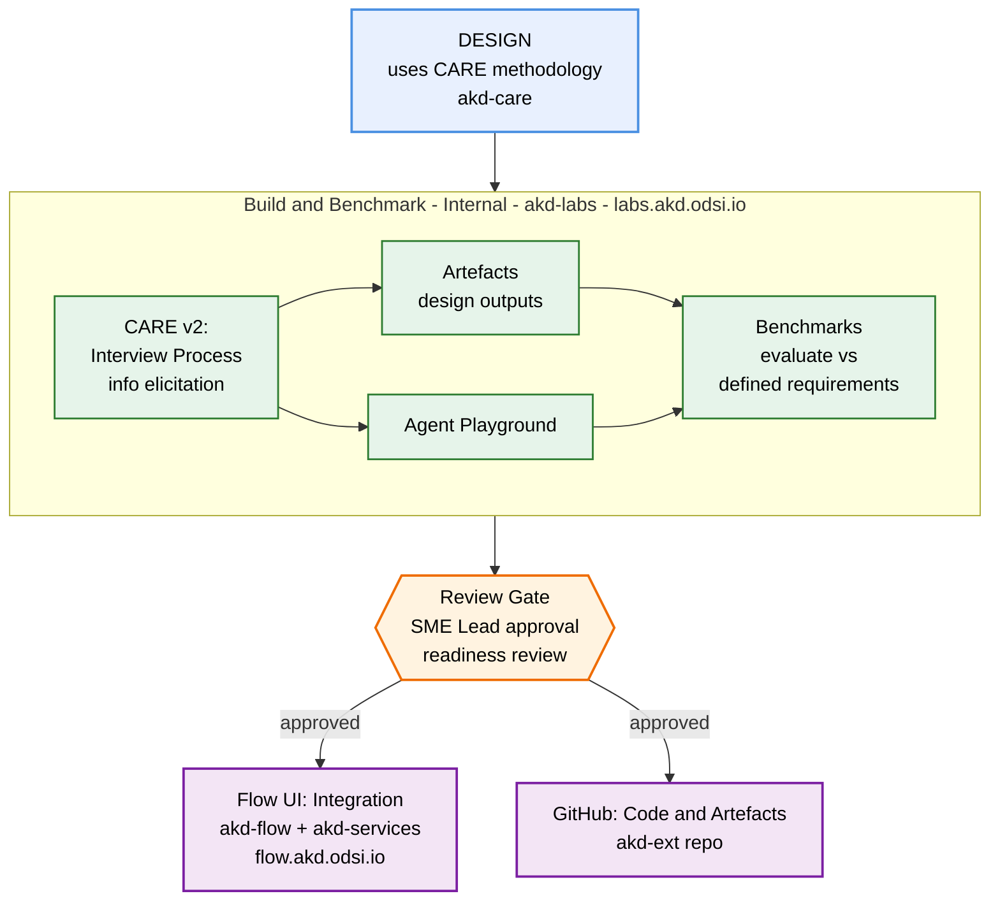

# AKD — Accelerated Knowledge Discovery

**AKD** is a NASA-IMPACT program that accelerates scientific knowledge discovery — data, code, and tools — across NASA's Science Mission Directorate divisions. It combines a multi-agent framework, a workflow-oriented web product, and an experimental lab into a single ecosystem.

This repository (`akd-suite`) is the **public documentation hub** for everything AKD. Browse here first.

> **Broader context:**
> - [NASA-IMPACT/AI-Agents-for-Science](https://github.com/NASA-IMPACT/AI-Agents-for-Science) — the umbrella NASA-IMPACT initiative on AI agents for science, which AKD is a part of.
> - [NASA-IMPACT/akd-care](https://github.com/NASA-IMPACT/akd-care) — the underlying **CARE (Collaborative Agent Reasoning Engineering)** methodology used to design AKD's domain agents: a staged, artifact-driven discipline across five phases (scope, key-info elicitation, reasoning policy, prompt architecture, benchmarking).

---

## Agent development lifecycle

> `akd-suite` (this repo) documents the entire lifecycle above. `akd-core` is the shared base library used by `akd-ext` and `akd-services` — a substrate, not a phase.

- [**Frameworks**](./frameworks/) — the Python libraries that define how AKD agents and tools are built: `akd-core` (primitives) and `akd-ext` (domain agents and tools).
- [**Agents**](./agents/) — the domain agents published to Flow: CMR, PDS, Code Search, Astro, Gap, and the Closed-Loop CM1 pipeline.
- [**Guardrails**](./guardrails/) — reusable input/output safety providers: Granite Guardian and the Risk Agent.
- [**Flow**](./flow/) — the multi-agent workflow product deployed at [flow.akd.odsi.io](https://flow.akd.odsi.io).
- [**Labs**](./labs/) — the experimental agent playground at [labs.akd.odsi.io](https://labs.akd.odsi.io).
- [**Docs**](./docs/) — cross-cutting concepts: what AKD is, the ecosystem narrative, glossary, MCP integration, streaming and human-in-the-loop.

---

## Where to start

| If you are a… | Start with |
| --- | --- |
| **Scientist / researcher** wanting to use AKD | [`flow/user-guide.md`](./flow/user-guide.md) |
| **Agent developer** wanting to build new agents | [`frameworks/akd-ext/build-a-custom-agent.md`](./frameworks/akd-ext/build-a-custom-agent.md) |
| **Contributor** exploring an agent's reasoning | [`agents/`](./agents/) |
| **Operator / SRE** deploying AKD | [`flow/deployment.md`](./flow/deployment.md) |
| **Curious newcomer** | [`docs/what-is-akd.md`](./docs/what-is-akd.md) |

---

## The five AKD working repos

`akd-suite` references but does not replace the five repos where AKD code lives:

- **[akd-core](https://github.com/NASA-IMPACT/akd-core)** — base framework: `BaseAgent`, `BaseTool`, streaming events, guardrails, planner. Python package `akd`.
- **[akd-ext](https://github.com/NASA-IMPACT/akd-ext)** — domain agents and tools. Python package `akd_ext`.
- **[akd-services](https://github.com/NASA-IMPACT/akd-services)** — FastAPI + LangGraph backend, the runtime behind Flow.
- **[akd-flow](https://github.com/NASA-IMPACT/akd-flow)** — Next.js frontend for Flow.
- **[akd-labs](https://github.com/NASA-IMPACT/akd-labs)** — multi-tenant lab and benchmarking platform.

See [`docs/ecosystem.md`](./docs/ecosystem.md) for the full narrative.

---

## Conventions used in this repo

- **Each directory has an entry point.** `README.md` at the top level of every section; `index.md` inside artifact trees.
- **Artifact content is code-free.** The per-agent `artifacts/` directories are written as the consumable knowledge layer for agents — no code blocks, file paths, or line numbers. Code snippets appear only under [`frameworks/`](./frameworks/) where developer-oriented guides belong.
- **Kebab-case directories** (`code-search`, `closed-loop-cm1`, `risk-agent`) for URL-friendliness.
- **Upstream fidelity.** For every published agent, the artifact mirrors the agent's current akd-ext system prompt and tool configuration. No invented sections, no paraphrasing.

---

## License

See [`LICENSE`](./LICENSE).
