<!-- _class: lead -->
<!-- _paginate: false -->
<!-- _header: '' -->

# Context & Harness Engineering
## Lessons from **AKD**

**Nishan Pantha** · NASA-IMPACT
2nd ESA-NASA International Workshop on AI Foundation Models for Earth Observation
Day 4 / Track 1 — GeoAI Agent Tutorial · May 2026

<!--
Hi everyone. Quick framing for the hands-on you're about to do. We'll spend ~15 minutes on the *vocabulary* that's reshaping production agent systems — context engineering and harness engineering — and then I'll show how AKD applies these ideas. The agent artifact you'll run in the notebook uses the same patterns.
-->

---

## The bottleneck has moved

> "Context engineering is the delicate art and science of filling the context window with just the right information for the next step."
> — **Andrej Karpathy**, June 2025

The **model** isn't the bottleneck anymore.
The **system around the model** is.

PROMPT → CONTEXT CONTEXT → HARNESS

<!--
Three years ago, "make the prompt better" was the lever. Today, frontier models are roughly interchangeable for most tasks — the differentiator is what you put in front of them and how you wrap the loop around them. That's the topic of this talk.
-->

---

## Prompt engineering → context engineering

<!--
Prompt engineering: a clever string. Context engineering: a system that decides, at every step, what goes in the window. Walden Yan at Cognition calls it "effectively the #1 job of engineers building AI agents." Anthropic codified it in their September 2025 piece "Effective context engineering for AI agents."
-->

---

## The four pillars

<!--
LangChain's framing — write, select, compress, isolate. Externalize state outside the window. Pull in only what's relevant. Summarize when it grows. Partition across sub-agents. Remember these four words — every other slide hangs off them.
-->

---

## How contexts fail

<!--
The four ways contexts fail — poisoning, distraction, confusion, clash. Two recent pieces of evidence: Chroma's "context rot" (2025) showed every frontier model degrades as input grows; and Modarressi et al.'s **NoLiMa** benchmark (arXiv:2502.05167, 2025) — the peer-reviewed reference — found models fail sharply on long context when the answer requires *inference* rather than literal keyword match, well before reaching their claimed window size. The lesson: more tokens isn't more capability. Treat the window as a finite attention budget, not free storage.
-->

---

## Harness engineering

> **"~98% of Claude Code is deterministic infrastructure."** — the agent loop is a while-loop; the harness does the work.

A capable model + a poor harness loses to a weaker model + a great harness. Reliability lives in the surrounding **deterministic** code — tools, loop, guardrails, state.

Anthropic — "Harness design for long-running application development" · OpenAI — "Harness engineering"

<!--
Coined recently by OpenAI and Anthropic. The shorthand from analyses of Claude Code: ~98% of the system is deterministic infrastructure — only ~2% is "the agent." Permissions, context management, tool routing, recovery — that's the harness.
-->

---

## The live architectural debate

### Cognition (Devin)
**"Don't build multi-agents."**

One thread, one context.
Actions carry implicit decisions; multiple agents make conflicting decisions.

→ single-agent + long context + compaction.

### Anthropic (Research)
**Multi-agent works — if you isolate.**

Orchestrator + sub-agents, each with own context, explicit hand-offs.

→ parallelism for breadth; isolation prevents clash.

 

**AKD's pragmatic middle:** single thread *per agent*; multi-agent only at workflow boundaries with explicit hand-offs and human approval gates.

<!--
This is *the* live debate. Cognition wrote "Don't build multi-agents" — they argue actions carry implicit decisions and parallel agents conflict. Anthropic published their research multi-agent system showing it works when sub-agents are isolated. AKD doesn't pick a side dogmatically — single thread per agent, multi-agent only at the workflow level.
-->

---

## What others are doing — and what AKD borrows

### Coding & general agents
- **Claude Code** — deterministic harness · `CLAUDE.md` / **Agent Skills** · permissions
- **Devin / Cognition** — single thread · long context · checkpointing
- **AutoGen · Magentic-One** (MS) — planner + multi-agent orchestrator
- **OpenAI Deep Research** — plan → retrieve → synthesize

### Scientific agents
- **Sakana AI Scientist v2** — end-to-end paper generation
- **Google AI co-scientist** — hypothesis generation + critique
- **ChemCrow** — chemistry tool-using agent
- **MS × NASA hydrology** · NASA deep-research bots — EO domain

**AKD inherits** — deterministic harness + HITL (*Claude Code*) · single thread per agent (*Devin*) · LangGraph at workflow edges (*AutoGen*) · plan→retrieve→synthesize (*Deep Research*) · tool curation + benchmarks (*ChemCrow, AI Scientist*).

<!--
Quick landscape. Top-left, the general-purpose harnesses people are building today — Claude Code is the cleanest reference because Anthropic published their patterns. Top-right, what the scientific-agent community is doing — Sakana, Google co-scientist, ChemCrow, STORM, the Microsoft NASA hydrology work. AKD isn't inventing these patterns; it's *adapting* them to NASA SMD. The bottom line shows the specific lineage — every AKD design choice maps to a precedent.
-->

---

## Meet AKD

**Accelerated Knowledge Discovery** — NASA-IMPACT program.
A **composable multi-agent framework** for NASA's Science Mission Directorate.

### Five divisions
- Earth Science
- Planetary Science
- Astrophysics
- Heliophysics
- Biological & Physical Sciences

### Five working repos
- `akd-core` — primitives
- `akd-ext` — domain agents + tools
- `akd-services` — Flow **SDK** · agent · workflow · DB substrate for any project
- `akd-flow` — Next.js frontend
- `akd-labs` — full **lifecycle**: design (CARE) · build · debug · synth-bench

**Today** — 6 domain agents · the CM1 pipeline · 2 guardrail providers · live at **flow.akd.odsi.io**.

<!--
30-second pitch. NASA-IMPACT's program for AI-augmented scientific knowledge discovery. Not a single product — a layered ecosystem. Today there are domain agents for the major NASA data systems, a closed-loop atmospheric simulation pipeline, framework-level guardrails, and two web products (Flow and Labs).
-->

---

## Agent development lifecycle

Every published agent passes through this loop. **Context engineering is built in** — not a step at the end.

<!--
This is the AKD agent-development-lifecycle. Design uses the CARE methodology — I'll show that next. Build & benchmark happens in Labs. There's an explicit review gate where an SME signs off. Only then does an agent go to Flow or GitHub. The point: context engineering is *not* "tweak the prompt at the end" — it's the discipline that runs end-to-end.
-->

---

## Context engineering @ AKD — **CARE**

**CARE = Collaborative Agent Reasoning Engineering**
A staged, artefact-driven discipline. Five phases:

| # | Phase | Output |
|---|---|---|
| 1 | **Scope** | Who, what, when, success criteria |
| 2 | **Key-info elicitation** | Domain knowledge interview transcripts |
| 3 | **Reasoning policy** | The loop the agent will run |
| 4 | **Prompt architecture** | The artifact directory |
| 5 | **Benchmarking** | Test suite + rubric |

> *Context engineering — but as a discipline, not an afterthought.*

→ akd-care repository · lineage: tool-curation rigour from *ChemCrow* · prompt architecture from *Claude Code's CLAUDE.md / AGENTS.md*

<!--
CARE is AKD's methodology for designing an agent. Five phases, each producing a concrete artifact. Notice what's missing: code. The first four phases don't write Python — they write markdown. The agent doesn't exist as a class until phase 4-5; before that, it's a documented intent.
-->

---

## Artifacts as the knowledge layer

lineage: evolution of *Claude Code's* `CLAUDE.md` + *Anthropic's* **Agent Skills** (`SKILL.md` + supporting files); AKD calls them **artifacts** — the *tutorial agent* uses this pattern verbatim.

<!--
Here's the artifact shape AKD agents use. And — this is the punchline — it's the *same* shape as the Prithvi agent you're about to run in the tutorial. scope, contexts, tools, guardrails, reasoning, output, agents.md as the entry point. The agent reads agents.md, then pulls in specific files on demand through its console tools. The notebook code doesn't stitch files together; the *agent* navigates its own knowledge base.
-->

---

## Harness engineering @ AKD

lineage: typed-events + checkpointing from *LangGraph* · HITL-as-tool from *Claude Code's* permission model · guardrail composition extends *OpenAI Agents SDK* patterns.

<!--
The AKD harness in one picture. Schema-first BaseAgent and BaseTool — Pydantic in, Pydantic out. Typed StreamEvents — every step emits an event, the UI never polls. HITL as a tool — the HumanTool raises an exception, the run pauses with state persisted in Postgres via LangGraph checkpoints, resumes when the human answers. Composable guardrails — `granite >> risk_agent` with fail-fast semantics. All of this is built once in akd-core and reused by every agent.
-->

---

## MCP — pluggable scientific data

**Agent code never touches API keys or HTTP clients.** Swap an upstream source by changing one env var. Same MCP server feeds multiple agents — `allowed_tools` differs.

lineage: *Anthropic's* Model Context Protocol, now adopted by OpenAI Agents SDK · AKD applies it to **NASA data systems** (CMR · PDS · ADS · Astroquery · job mgmt).

<!--
Every AKD agent that needs external data does it through MCP. The agent knows three things: server label, server URL (from an env var), and the whitelist of allowed tool names. The MCP server handles auth, rate limiting, response shaping. This means the agent stays small and reasoning-focused, and the same MCP server can be wired into multiple agents.
-->

---

## End-to-end: Closed-Loop CM1

Atmospheric simulation research with **CM1 / WRF**. Five autonomous stages, **human approval between every stage**.
Each stage has its own artifact, context, and guardrails. Hand-offs are explicit.

lineage: staged-pipeline pattern from *Sakana AI Scientist* + *Google AI co-scientist*, with HITL gates between stages (AKD addition).

<!--
Concrete example. The CM1 closed-loop pipeline takes a researcher from a question to a paper-style report. Five stages: gap analysis, feasibility against CM1/WRF + the cluster, workflow specification, implementation as actual job submissions, report generation. Human approval at every gate. This is what AKD's harness + context engineering looks like at workflow scale — and it's deployed today.
-->

---

## Takeaways — and the tie-back

### Three things to take away

1. **Artifact-driven context** — write the agent's knowledge as files, not code.
2. **Deterministic harness** — the loop is small; the surrounding infra is most of the value.
3. **Evaluation closes the loop** — without benchmarking, "context engineering" is just vibes.

### Tie-back to today's tutorial

The Prithvi agent you'll run loads from an **artifact** with `scope.md / contexts/ / tools/ / guardrails/ / reasoning.md / output.md / agents.md`.

**Same shape as AKD.** Same ideas, applied to EO foundation models.

 

**Read:** akd-suite repo · Anthropic *Effective context engineering* · Cognition *Don't build multi-agents* · dbreunig.com *How Long Contexts Fail* · Chroma *Context Rot* · OpenAI *Harness engineering*

 

**Thank you · questions?** — `github.com/NASA-IMPACT/akd-suite`

<!--
Three takeaways. One: write context as files, not code. Two: most of the value is in the deterministic harness. Three: evaluation is what makes context engineering a discipline rather than a vibe. And the tie-back — the agent you're about to run in the next 90 minutes uses the same artifact shape AKD uses across NASA SMD. Take the patterns home. Thanks.
-->
