<!-- _class: lead -->
<!-- _paginate: false -->
<!-- _header: '' -->

# Context & Harness Engineering
## Lessons from **AKD**

**Nishan Pantha** · NASA-IMPACT
2nd ESA-NASA International Workshop on AI Foundation Models for Earth Observation
Day 4 / Track 1 — GeoAI Agent Tutorial · May 2026

<!--
Hi everyone. Quick framing for the hands-on you're about to do. We'll spend ~15 minutes on the *vocabulary* that's reshaping production agent systems — context engineering and harness engineering — and then I'll show how AKD applies these ideas. The agent artifact you'll run in the notebook uses the same patterns.
-->

---

## The bottleneck has moved

> "Context engineering is the delicate art and science of filling the context window with just the right information for the next step."
> — **Andrej Karpathy**, June 2025

The **model** isn't the bottleneck anymore.
The **system around the model** is.

PROMPT → CONTEXT CONTEXT → HARNESS

<!--
Three years ago, "make the prompt better" was the lever. Today, frontier models are roughly interchangeable for most tasks — the differentiator is what you put in front of them and how you wrap the loop around them. That's the topic of this talk.
-->

---

## Prompt engineering → context engineering

<!--
Prompt engineering: a clever string. Context engineering: a system that decides, at every step, what goes in the window. Walden Yan at Cognition calls it "effectively the #1 job of engineers building AI agents." Anthropic codified it in their September 2025 piece "Effective context engineering for AI agents."
-->

---

## The four pillars

<!--
LangChain's framing — write, select, compress, isolate. Externalize state outside the window. Pull in only what's relevant. Summarize when it grows. Partition across sub-agents. Remember these four words — every other slide hangs off them.
-->

---

## How contexts fail

<!--
The four ways contexts fail — poisoning, distraction, confusion, clash. Two recent pieces of evidence: Chroma's "context rot" (2025) showed every frontier model degrades as input grows; and Modarressi et al.'s **NoLiMa** benchmark (arXiv:2502.05167, 2025) — the peer-reviewed reference — found models fail sharply on long context when the answer requires *inference* rather than literal keyword match, well before reaching their claimed window size. The lesson: more tokens isn't more capability. Treat the window as a finite attention budget, not free storage.
-->

---

## Harness engineering

> **"~98% of Claude Code is deterministic infrastructure."** — the agent loop is a while-loop; the harness does the work.

A capable model + a poor harness loses to a weaker model + a great harness. Reliability lives in the surrounding **deterministic** code — tools, loop, guardrails, state.

Anthropic — "Harness design for long-running application development" · OpenAI — "Harness engineering"

<!--
Coined recently by OpenAI and Anthropic. The shorthand from analyses of Claude Code: ~98% of the system is deterministic infrastructure — only ~2% is "the agent." Permissions, context management, tool routing, recovery — that's the harness.
-->

---

## AKD Adaptation

<!--
Visual lineage. Left column: the external systems that shaped AKD's design. Right column: AKD's primitives. Arrows show what borrows from where — deterministic harness and artifact-driven context from Claude Code, checkpointing and typed events from LangGraph, plan-retrieve-synthesize from OpenAI Deep Research, tool curation rigor from ChemCrow, the staged scientific pipeline from Sakana AI Scientist. Two AKD primitives sit on the right with no incoming arrows — composable guardrails and the CARE methodology. Those are AKD's own contributions, not borrowed.
-->

---

## AKD today — and how we build it

**6 domain agents** · **two closed-loop workflows** (CM1, FM Inference) · live across **Earth Science · Astrophysics · Planetary Science** · **flow.akd.odsi.io**

**Composable guardrails** — *input*: Granite Guardian (safety / HAP) · *output*: Risk Agent + Fact Reasoner (risk · factuality + attribution)

 

### → How do we actually build these agentic workflows?

Context engineering. Harness engineering. **CARE**.

<!--
Nidhi just walked you through AKD. Quick recap of where we stand: six domain agents in production across three SMD divisions, two closed-loop workflows running today — CM1 for weather computational modeling, FM Inference for Earth-observation foundation models. Composable guardrails wrap every agent — Granite Guardian on input for safety, Risk Agent and Fact Reasoner on output for domain-policy risk and factuality plus attribution. So the engineering question is: how do you actually build agents like these reliably? That's the next ten minutes — context engineering, harness engineering, and AKD's CARE methodology that ties them together.
-->

---

## AKD Labs — the 4-stage workbench

Every published agent passes through these four stages — **SME approval at every gate**, then **publish to the AKD registry**. *Context engineering is built in* — not a step at the end.

<!--
This is AKD Labs — the platform that operationalizes the agent development lifecycle. Four product stages: Design uses the CARE methodology to produce the full artifact tree (scope, contexts, tools, guardrails, reasoning, output, agents.md as the entry point); Build assembles a runnable agent from the CARE system prompt plus MCP tools plus your chosen model; Debug gives a step-by-step trace inspector with model reasoning, tool I/O, token and cost; Benchmark generates synthetic machine-gradable evals from the agent's own knowledge corpus, with closed-loop ground truth. Between every stage there's an SME approval gate — nothing advances without domain-expert sign-off. After the final SME review, agents publish to the AKD registry. And the dashed feedback loop matters: benchmark findings feed back into design. You can follow up at labs.akd.odsi.io.
-->

---

## Context engineering @ AKD — **CARE**

**CARE = Collaborative Agent Reasoning Engineering**
A staged, artefact-driven discipline. Five phases:

| # | Phase | Output |
|---|---|---|
| 1 | **Scope** | Who, what, when, success criteria |
| 2 | **Key-info elicitation** | Domain knowledge interview transcripts |
| 3 | **Reasoning policy** | The loop the agent will run |
| 4 | **Prompt architecture** | The artifact directory |
| 5 | **Benchmarking** | Test suite + rubric |

> *Context engineering — but as a discipline, not an afterthought.*

<!--
CARE is AKD's methodology for designing an agent. Five phases, each producing a concrete artifact. Notice what's missing: code. The first four phases don't write Python — they write markdown. The agent doesn't exist as a class until phase 4-5; before that, it's a documented intent. Lineage note (notes only): tool-curation rigor from ChemCrow; the prompt-architecture pattern evolves Claude Code's CLAUDE.md and AGENTS.md.
-->

---

## Artifacts as the knowledge layer

<!--
Here's the artifact shape AKD agents use. And — this is the punchline — it's the *same* shape as the Prithvi agent you're about to run in the tutorial. scope, contexts, tools, guardrails, reasoning, output, agents.md as the entry point. The agent reads agents.md, then pulls in specific files on demand through its console tools. The notebook code doesn't stitch files together; the *agent* navigates its own knowledge base. Lineage note (notes only): this pattern evolves Claude Code's CLAUDE.md and Anthropic's Agent Skills (SKILL.md + supporting files); AKD calls them artifacts.
-->

---

## Harness engineering @ AKD

**Composable guardrails** — *input*: Granite Guardian (HAP / safety) · *output*: Risk Agent (domain-policy risk) + Fact Reasoner (factuality + attribution) · *dimensions*: Attribution · Factuality · Groundedness.

**Multi-agent stance** — single thread per agent; multi-agent only at workflow boundaries, with explicit hand-offs and HITL gates.

<!--
The AKD harness in one picture. Schema-first BaseAgent and BaseTool — Pydantic in, Pydantic out. Typed StreamEvents — every step emits an event, the UI never polls. HITL as a tool — the HumanTool raises an exception, the run pauses with state persisted in Postgres via LangGraph checkpoints, resumes when the human answers. Composable guardrails wrap the agent on both sides: Granite Guardian as the input gate for HAP/safety screening; Risk Agent and Fact Reasoner on the output side for domain-policy risk and factuality plus attribution. The composition operator chains them — `granite >> risk_agent >> fact_reasoner` with fail-fast semantics, and any of them can be swapped per agent. The dimensions we score against are Attribution, Factuality, and Groundedness. On the multi-agent question — there's a real field debate (Cognition's "don't build multi-agents" vs Anthropic's research showing it works with isolation); AKD's pragmatic middle is single-thread per agent, multi-agent only at workflow boundaries with explicit hand-offs and HITL gates. Lineage (notes only): typed events + checkpointing from LangGraph; HITL-as-tool from Claude Code's permission model; guardrails as a primitive concept from OpenAI Agents SDK and Anthropic permissions — but the `>>` composition operator is AKD's own. All of this is built once in akd-core and reused by every agent.
-->

---

## MCP — pluggable scientific data

**Agent code never touches API keys or HTTP clients.** Swap an upstream source by changing one env var. Same MCP server feeds multiple agents — `allowed_tools` differs.

<!--
Every AKD agent that needs external data does it through MCP. The agent knows three things: server label, server URL (from an env var), and the whitelist of allowed tool names. The MCP server handles auth, rate limiting, response shaping. This means the agent stays small and reasoning-focused, and the same MCP server can be wired into multiple agents. Lineage (notes only): Anthropic's Model Context Protocol, now adopted by OpenAI Agents SDK; AKD applies it to NASA data systems — CMR, PDS, ADS, Astroquery, job management.
-->

---

## End-to-end: staged workflows in production

Both AKD workflows follow the same **staged pattern** — each stage carries its own *artifact*, *context*, *guardrails*; hand-offs are explicit; approval gates where needed.

**Instances live today** — **CM1** (weather computational modeling) · **FM Inference** (EO foundation-model inference)

<!--
Concrete proof at workflow scale. The pattern: each stage owns its artifact (context + reasoning + guardrails), hand-offs between stages are explicit, HITL approval gates where you want them. Two instances are running production today — CM1, the weather computational modeling pipeline; FM Inference, the EO foundation-model inference pipeline. Same harness pattern, two very different scientific workflows. Lineage (notes only): the staged-pipeline pattern owes to Sakana AI Scientist and Google AI co-scientist; HITL gates between stages are AKD's addition. That's what AKD's harness + context engineering looks like at workflow scale, deployed today.
-->

---

## Takeaways — and the tie-back

### Three things to take away

1. **Artifact-driven context** — write the agent's knowledge as files, not code.
2. **Deterministic harness** — the loop is small; the surrounding infra is most of the value.
3. **Evaluation closes the loop** — without benchmarking, "context engineering" is just vibes.

### Tie-back to today's tutorial

The Prithvi agent you'll run loads from an **artifact** with `scope.md / contexts/ / tools/ / guardrails/ / reasoning.md / output.md / agents.md`.

**Same shape as AKD.** Same ideas, applied to EO foundation models.

 

**Read:** akd-suite repo · Anthropic *Effective context engineering* · Cognition *Don't build multi-agents* · dbreunig.com *How Long Contexts Fail* · Chroma *Context Rot* · OpenAI *Harness engineering*

 

**Thank you · questions?** — `github.com/NASA-IMPACT/akd-suite`

<!--
Three takeaways. One: write context as files, not code. Two: most of the value is in the deterministic harness. Three: evaluation is what makes context engineering a discipline rather than a vibe. And the tie-back — the agent you're about to run in the next 90 minutes uses the same artifact shape AKD uses across NASA SMD. Take the patterns home. Thanks.
-->
