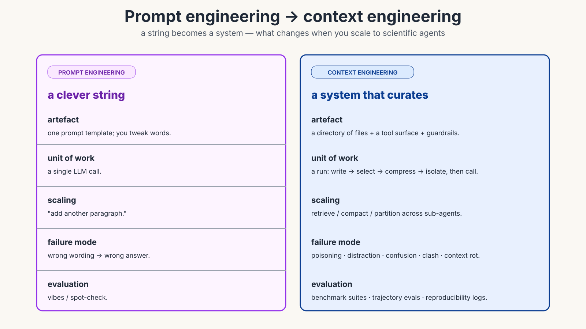
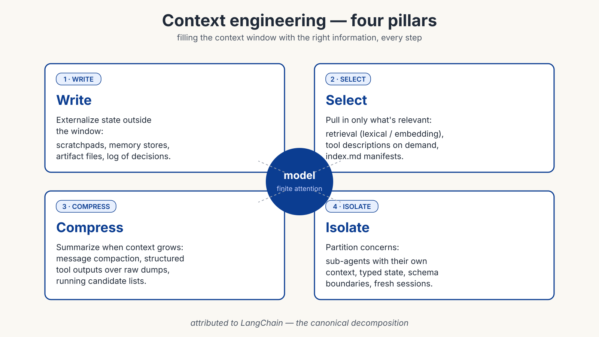
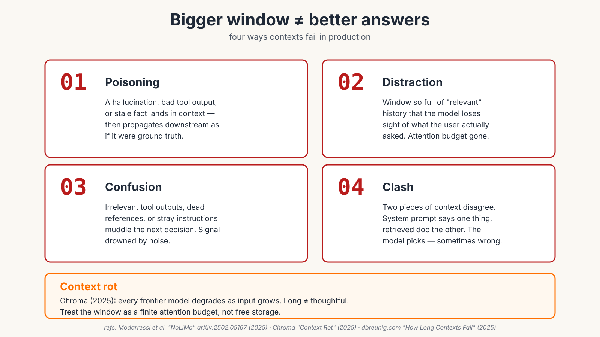
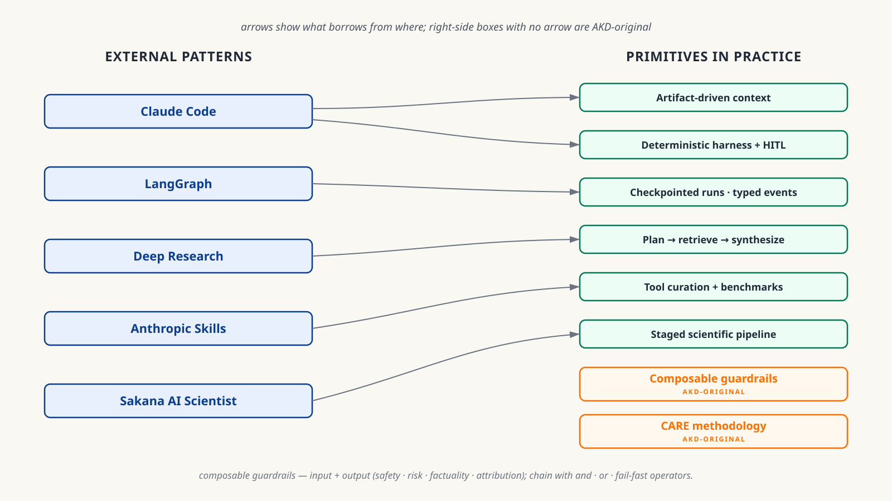
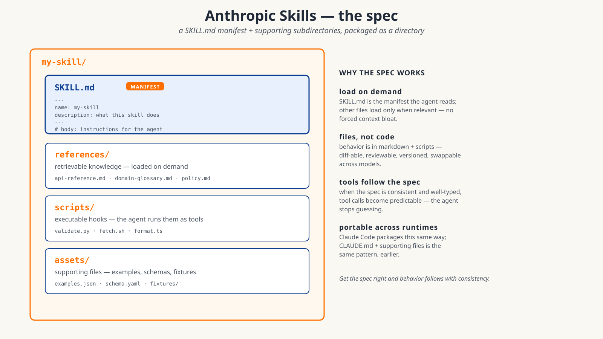
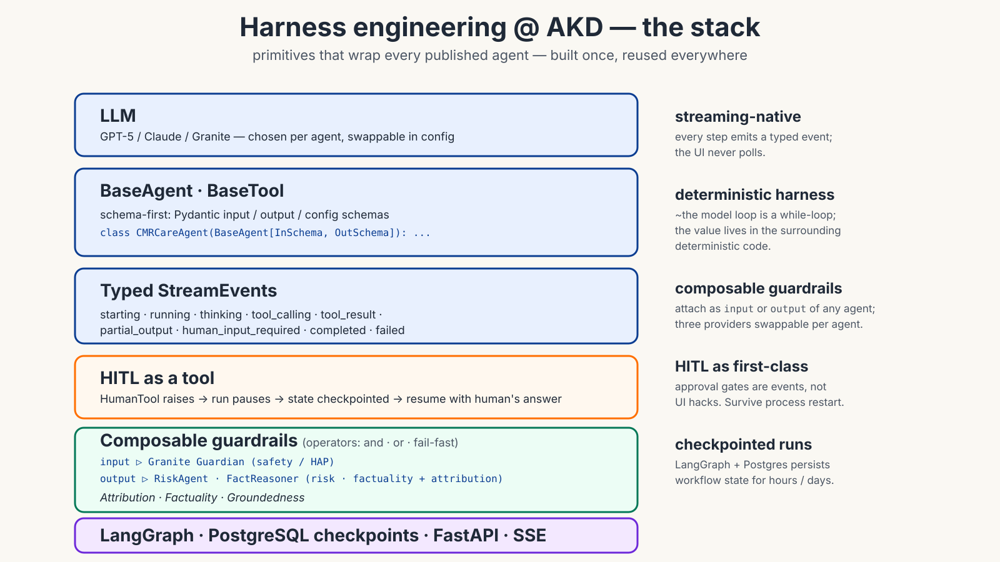
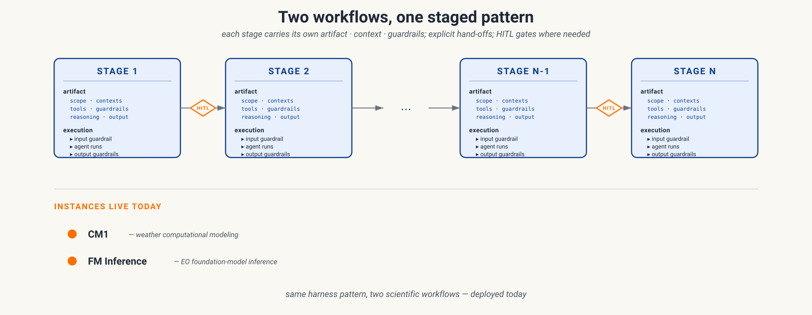
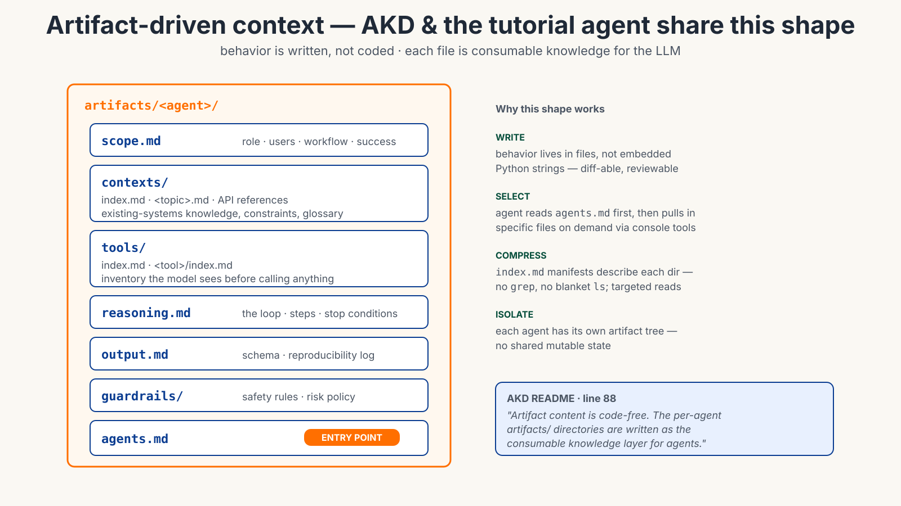
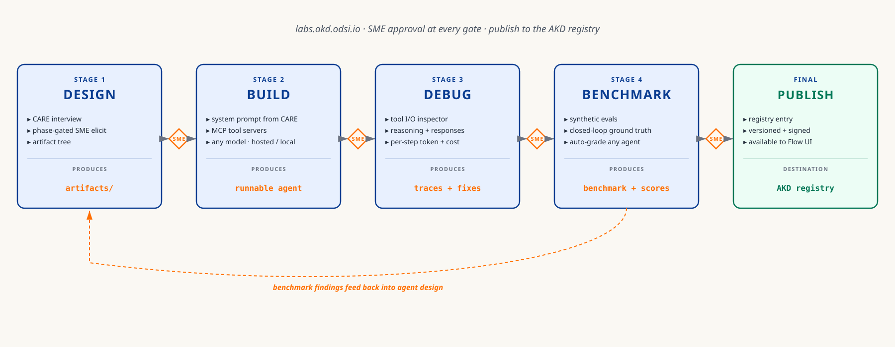

<!-- _class: lead -->
<!-- _paginate: false -->
<!-- _header: '' -->

# Context & Harness Engineering
## Lessons from **AKD**

**Nish (Nishan Pantha)** · NASA-IMPACT
2nd ESA-NASA International Workshop on AI Foundation Models for Earth Observation
Day 4 / Track 1 — GeoAI Agent Tutorial · May 2026

<!--
Hi everyone. Quick framing for the hands-on you're about to do. We'll spend ~15 minutes on the *vocabulary* that's reshaping production agent systems — context engineering and harness engineering — the patterns the community has converged on, and a brief AKD case study at the end. The agent artifact you'll run in the notebook uses the same patterns.
-->

---

## The bottleneck has moved

> "Context engineering is the delicate art and science of filling the context window with just the right information for the next step."
> — **Andrej Karpathy**, June 2025

The **model** isn't the bottleneck. What's around it is — the **context** that goes in, and the **harness** that wraps it.

CONTEXT ENGINEERING HARNESS ENGINEERING

<!--
Three years ago, "make the prompt better" was the lever. Today, frontier models are roughly interchangeable for most tasks — the differentiator is the context engineering that decides what goes into the window, and the harness engineering that wraps the loop around the model. Two disciplines, both deterministic, both durable. That's the topic of this talk.
-->

---

## Prompt engineering → context engineering

<!--
Prompt engineering: a clever string. Context engineering: a system that decides, at every step, what goes in the window. Walden Yan at Cognition calls it "effectively the #1 job of engineers building AI agents." Anthropic codified it in their September 2025 piece "Effective context engineering for AI agents."
-->

---

## The four pillars

<!--
LangChain's framing — write, select, compress, isolate. Externalize state outside the window. Pull in only what's relevant. Summarize when it grows. Partition across sub-agents. Remember these four words — every other slide hangs off them.
-->

---

## How contexts fail

<!--
The four ways contexts fail — poisoning, distraction, confusion, clash. Two recent pieces of evidence: Chroma's "context rot" (2025) showed every frontier model degrades as input grows; and Modarressi et al.'s **NoLiMa** benchmark (arXiv:2502.05167, 2025) — the peer-reviewed reference — found models fail sharply on long context when the answer requires *inference* rather than literal keyword match, well before reaching their claimed window size. The lesson: more tokens isn't more capability. Treat the window as a finite attention budget, not free storage.
-->

---

## Harness engineering

> **"~98% of Claude Code is deterministic infrastructure."** — the agent loop is a while-loop; the harness does the work.

A capable model + a poor harness loses to a weaker model + a great harness. Reliability lives in the surrounding **deterministic** code — tools, loop, guardrails, state.

> *"Agents are only as useful as what they can connect to."* — **Anthropic**, 2025

<!--
Coined recently by OpenAI and Anthropic. The shorthand from analyses of Claude Code: ~98% of the system is deterministic infrastructure — only ~2% is "the agent." Permissions, context management, tool routing, recovery — that's the harness. And the connectivity layer (tool calling, MCP servers, API integrations) is increasingly first-class — Anthropic's framing in 2025 captured it: the agent is only as good as what it can reach.
-->

---

## Community patterns

<!--
What the community has converged on. Left column: external systems that shaped these patterns. Right column: the primitives that production agent systems keep building. Arrows show inheritance — deterministic harness and artifact-driven context from Claude Code (CLAUDE.md) and Anthropic Skills (SKILL.md packages with tools bundled in); checkpointing and typed events from LangGraph; plan-retrieve-synthesize from Deep Research (OpenAI, Anthropic, and others); benchmarking — synthetic for baseline assessment, plus human-curated benchmarks at tool, harness, and overall agent level — drawing from Sakana AI Scientist's eval pipeline and the broader community; staged scientific pipelines from Sakana AI Scientist. Two primitives on the right have no incoming arrow — composable guardrails and CARE methodology — those are areas where AKD has added to the community pattern set. Point of this slide: the engineering patterns aren't proprietary; they're what works.
-->

---

## Artifacts as the knowledge layer

<!--
The artifact-driven pattern is the emerging community standard. Anthropic Skills (October 2025) is the most current and concrete spec: a SKILL.md manifest with frontmatter (name, description) plus a body of instructions, plus supporting subdirectories — references/ for retrievable knowledge, scripts/ for executable hooks, assets/ for supporting files. The key insight: SKILL.md is the only thing loaded eagerly; everything else is pulled in on demand via tools. Claude Code's CLAUDE.md + AGENTS.md is the same pattern, earlier. AKD's artifact tree (which we'll see in the case study) is this same shape — produced by CARE's SME-elicitation discipline. The discipline matters more than the framework name: a consistent, well-specced artifact tree means tool calls become predictable and the agent stops guessing. The Prithvi agent you'll run in the tutorial uses exactly this shape.
-->

---

## Harness primitives in practice

**Composable guardrails** — attach as *input* (HAP, policy, prompt-injection) or *output* (risk, factuality, attribution); chain with **and · or · fail-fast** operators; providers swappable per agent.

**Multi-agent stance** — single thread per agent; multi-agent only at workflow boundaries, with explicit hand-offs and HITL gates.

<!--
The harness stack in one picture. Schema-first BaseAgent and BaseTool — Pydantic in, Pydantic out. Typed StreamEvents — every step emits an event, the UI never polls. HITL as a tool — the HumanTool raises an exception, the run pauses with state persisted in Postgres via LangGraph checkpoints, resumes when the human answers. Composable guardrails wrap the agent on both sides: input guardrails (in our setup, Granite Guardian for HAP/safety screening); output guardrails (Risk Agent for domain-policy risk; Fact Reasoner for factuality plus attribution). The composition operator chains them — `granite >> risk_agent >> fact_reasoner` with fail-fast semantics, and any provider can be swapped per agent. The dimensions we score against are Attribution, Factuality, and Groundedness. On the multi-agent question — there's a real field debate (Cognition's "don't build multi-agents" vs Anthropic's research showing it works with isolation); our pragmatic middle is single-thread per agent, multi-agent only at workflow boundaries with explicit hand-offs and HITL gates. Lineage: typed events + checkpointing from LangGraph; HITL-as-tool from Claude Code's permission model; guardrails as a primitive concept from OpenAI Agents SDK and Anthropic permissions — the `>>` composition operator is the addition we made. Built once in core, reused by every agent.
-->

---

## End-to-end: staged workflows in production

Both AKD workflows follow the same **staged pattern** — each stage carries its own *artifact*, *context*, *guardrails*; hand-offs are explicit; approval gates where needed.

**Instances live today** — **CM1** (weather computational modeling) · **FM Inference** (EO foundation-model inference)

<!--
Concrete proof at workflow scale. The pattern: each stage owns its artifact (context + reasoning + guardrails), hand-offs between stages are explicit, HITL approval gates where you want them. Two instances running production today — CM1, the weather computational modeling pipeline; FM Inference, the EO foundation-model inference pipeline. Same staged pattern, two very different scientific workflows. The staged-pipeline shape itself owes to work like Sakana AI Scientist and Google AI co-scientist; HITL gates between stages are something AKD added.
-->

---

## AKD today — a case study

**CARE produces this artifact tree.** Same pattern as Anthropic Skills — `scope.md`, `contexts/`, `tools/`, `guardrails/`, `reasoning.md`, `output.md`, with `agents.md` as the entry-point manifest. 6 domain agents · 2 closed-loop workflows (CM1, FM Inference) · live across Earth Science · Astrophysics · Planetary Science · **flow.akd.odsi.io**

<!--
Brief AKD framing — Nidhi covered CARE in the preceding session; AKD is the broader multi-agent framework that CARE sits inside. CARE is the design discipline that produces our artifact trees — the same artifact shape we just covered, with the SME-elicitation phases that make it auditable. Six domain agents in production across three SMD divisions, two closed-loop workflows running today — CM1 for weather computational modeling, FM Inference for Earth-observation foundation models. Composable guardrails wrap every agent — Granite Guardian on input for safety, Risk Agent and Fact Reasoner on output for risk and factuality plus attribution. Next slide shows how Labs operationalizes the whole thing.
-->

---

## AKD Labs — the 4-stage workbench

Every published agent passes through the same 4-stage workbench — **SME approval at every gate**, **publish to the AKD registry**. Context · harness · guardrails · evaluation, all wired in.

<!--
This is how the methodology runs end-to-end across AKD. Every agent goes through Labs: Design via CARE produces the full artifact tree; Build assembles the runnable agent from system prompt, MCP tools, and chosen model; Debug gives the trace inspector for tool I/O, reasoning, and cost; Benchmark generates synthetic machine-gradable evals from the agent's own corpus. SME approval at every gate. Final publish to the AKD registry. Benchmark findings feed back into design. Try it at labs.akd.odsi.io.
-->

---

## Takeaways

### Three things to take away

1. **Own your tools and harness.**
2. **Artifact-driven context** — write the agent's knowledge as files, not code.
3. **Evaluation closes the loop** — without benchmarking, "context engineering" is just vibes.

### Tie-back to today's tutorial

The Prithvi agent you'll run loads from an **artifact** with `scope.md / contexts/ / tools/ / guardrails/ / reasoning.md / output.md / agents.md`.

Same shape as the production patterns we just covered — applied to EO foundation models.

**Read:** Anthropic *Effective context engineering* · Cognition *Don't build multi-agents* · dbreunig.com *How Long Contexts Fail* · Chroma *Context Rot* · OpenAI *Harness engineering*

**Thank you · questions?** — `github.com/NASA-IMPACT/akd-suite` · `labs.akd.odsi.io`

<!--
Three takeaways. One — own your tools and harness. Models change fast; your engineering doesn't. The harness, tools, context, and evals stay yours as you swap models in and out. Two — write context as files, not code. Three — evaluation is what turns context engineering into a discipline rather than vibes. The tie-back: the Prithvi agent you'll run uses the same artifact shape these patterns describe. Thanks — happy to take questions.
-->